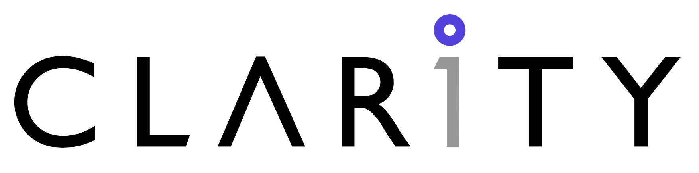

# Clarity Invoicing Application

A modern Laravel-based invoicing system with organization-centric architecture, multi-currency support, and comprehensive document management.

## Getting Started

### Development Environment (Laravel Sail)

1. Clone the repository and install dependencies:
```shell
docker run --rm \
    -u "$(id -u):$(id -g)" \
    -v "$(pwd):/var/www/html" \
    -w /var/www/html \
    laravelsail/php84-composer:latest \
    composer install --ignore-platform-reqs
```

2. Start the development environment:
```bash
sail up -d
sail artisan migrate:fresh --seed
```

### Production Deployment

The application includes comprehensive **production Docker configurations** with multiple deployment options:

#### Quick Production Deployment
```bash
# FrankenPHP + Laravel Octane (Recommended)
docker-compose -f docker/production/docker-compose.prod.yml up -d

# Traditional Nginx + PHP-FPM
docker build -f docker/production/Dockerfile.nginx-fpm -t invoicing-nginx:latest .
docker run -d -p 80:80 -e APP_KEY=your-key invoicing-nginx:latest
```

#### Available Production Variants
- **🚀 FrankenPHP + Octane**: High-performance with HTTP/2/3 support (`Dockerfile.frankenphp`)
- **🔧 Nginx + PHP-FPM**: Traditional architecture with H5BP optimizations (`Dockerfile.nginx-fpm`)  
- **📦 Standalone Binary**: Ultra-minimal deployment (`Dockerfile.standalone`)

**📚 Production Guides:**
- [Production README](docker/production/README.md) - Complete deployment guide
- [H5BP Quick Start](docker/production/QUICK-START-H5BP.md) - H5BP nginx configuration
- [Test Results](docker/production/test-results/) - Comprehensive validation reports


## Database Management with pgweb

The project includes [pgweb](https://github.com/sosedoff/pgweb), a web-based PostgreSQL database browser. 

**Accessing pgweb:**
1. Ensure services are running: `sail up -d`
2. Open pgweb interface at: http://localhost:8081

**Features:**
- View and query database tables
- Run SQL commands
- Export/import data
- View table schemas

**Configuration:**
- Default port: 8081 (customize via `FORWARD_PGWEB_PORT` in `.env`)
- Automatically connects to the PostgreSQL service using credentials from `.env`

The interface will be available after starting the Docker containers.

## Introduction
The Clarity Invoicing Application is a comprehensive Laravel-based invoicing system designed with organization-centric architecture. It provides robust invoice and estimate management with multi-currency support, tax templates, and PDF generation capabilities.

## Features  
- **Organization-Centric Architecture**: Unified organization model replacing team/company separation
- **Multi-Currency Support**: Support for AED, USD, EUR, GBP, INR with proper currency symbols
- **Tax Templates**: Flexible tax system supporting multiple countries (UAE, India, etc.)
- **Invoice & Estimate Management**: Complete document lifecycle with status tracking
- **PDF Generation**: High-quality PDF generation using Spatie Browsershot
- **Public Document Sharing**: ULID-based public URLs for invoices and estimates
- **Livewire Components**: Modern reactive UI components for seamless user experience
- **Comprehensive Testing**: 94.7% test coverage with Unit, Feature, and Browser tests
- **Production Ready**: Multi-variant Docker deployments with H5BP nginx optimizations
- **High Performance**: Laravel Octane + FrankenPHP with HTTP/2/3 support
- **Security Hardened**: HTML5 Boilerplate security headers and rate limiting
- **Auto-Updating**: Automated H5BP configuration sync with monthly update checks  

## Development Standards  
- **Coding Standards:** Follow PSR-12 and Laravel coding conventions
- **Testing:** Maintain 90%+ test coverage with comprehensive Unit, Feature, and Browser tests
- **Architecture:** Follow Domain-Driven Design principles with Value Objects and Service Layer patterns
- **Git Workflow:** Use conventional commits with atomic changes and linear history
- **Code Quality:** Run `sail pint --dirty` before all commits to maintain code formatting

## Technology Stack
- **Backend:** Laravel 12.19.3 with PHP 8.4.8 + Laravel Octane
- **Database:** PostgreSQL 17 with comprehensive migrations and seeding
- **Frontend:** Livewire 3.6.3 + luvi-ui/laravel-luvi (shadcn for Livewire)
- **Testing:** Pest framework with Laravel Dusk for browser testing (544 tests, 94.7% coverage)
- **PDF Generation:** Spatie Browsershot with headless Chrome
- **Web Server:** FrankenPHP with HTTP/2/3 support OR Nginx with H5BP optimizations
- **Performance:** Laravel Octane for high-performance request handling
- **Security:** HTML5 Boilerplate (H5BP) security headers and configurations
- **Containerization:** Laravel Sail (development) + Production Docker variants
- **CI/CD:** GitHub Actions with automated testing and H5BP sync

## Architecture Overview

### Application Architecture
- **Organization Model**: Unified business entity management (replaces Team/Company)
- **Customer Management**: Customer entities with polymorphic location relationships
- **Invoice System**: Unified invoice/estimate model with flexible tax handling
- **Location System**: Polymorphic location model serving organizations and customers
- **Value Objects**: ContactCollection, InvoiceTotals for robust data handling
- **Service Layer**: InvoiceCalculator, PdfService, EstimateToInvoiceConverter

### Production Deployment Architecture

#### Container Variants
1. **🚀 FrankenPHP + Octane** (Recommended)
   - Laravel Octane with FrankenPHP driver for maximum performance
   - HTTP/2 and HTTP/3 support via Caddy
   - Supervisor for background processes (queues, scheduler)
   - Image size: ~1.23GB | Test duration: ~48s

2. **🔧 Nginx + PHP-FPM** (Traditional)
   - Production-hardened Nginx with HTML5 Boilerplate optimizations
   - Enhanced security headers and rate limiting
   - File-type specific caching and compression
   - Image size: ~1.14GB | Test duration: ~41s

3. **📦 Standalone Binary** (Minimal)
   - Single binary containing entire Laravel application
   - Ultra-minimal deployment for edge/serverless environments
   - FrankenPHP static compilation
   - Estimated size: ~200MB

#### H5BP Nginx Integration
- **Security**: 6+ comprehensive headers including CSP and Permissions Policy
- **Performance**: File-type specific caching (CSS/JS: 1yr, images: 1mo)
- **Compression**: Advanced gzip for 15+ MIME types (60-80% bandwidth reduction)
- **Rate Limiting**: Authentication (10/min) and API (60/min) protection
- **Auto-Updates**: Monthly H5BP sync with automated PR creation

#### CI/CD & Automation
- **GitHub Actions**: Automated Docker builds with multi-platform support
- **H5BP Sync**: Monthly checks for configuration updates
- **Testing Pipeline**: 544 tests with comprehensive validation
- **Security Scanning**: Automated vulnerability detection

## License  
This application is intellectual property of CLARITY Technologies.
