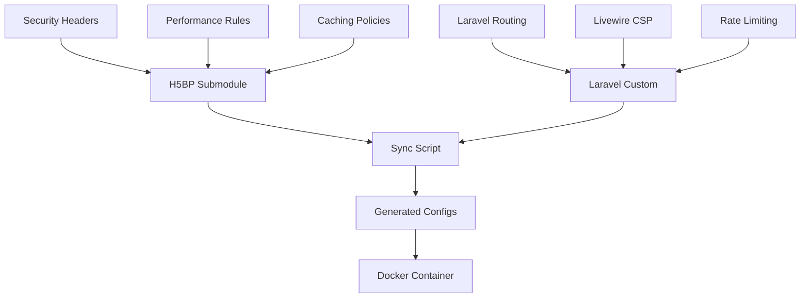

# Nginx Configuration Structure After H5BP Integration

## 📁 Current Structure (Clean)

After H5BP integration and cleanup, the nginx configuration follows a clear, maintainable structure:

```
docker/production/nginx/
├── README-H5BP-SYNC.md          # Documentation
├── h5bp/                        # 📦 Official H5BP (submodule v5.0.1)
│   ├── h5bp/                    # H5BP configuration modules
│   │   ├── security/            # Security headers and policies
│   │   ├── web_performance/     # Caching and compression
│   │   ├── location/            # Location-specific rules
│   │   └── ...                  # Other H5BP modules
│   └── mime.types               # Official MIME types
├── laravel-custom/              # 🎯 Laravel-specific settings
│   ├── laravel-csp.conf         # Livewire-compatible CSP
│   ├── laravel-overrides.conf   # Laravel routing & PHP-FPM
│   └── laravel-rate-limits.conf # Auth & API rate limiting
└── generated/                   # ⚙️ Auto-merged configurations
    ├── nginx.conf               # Main nginx config with H5BP includes
    ├── laravel-site.conf        # Server block with merged settings
    ├── VERSION                  # H5BP version tracking
    └── Dockerfile.nginx-snippet # Copy instructions for Dockerfile
```

## ✅ Required Files

### 1. **H5BP Submodule** (`h5bp/`)
- **Purpose**: Official HTML5 Boilerplate nginx configurations
- **Management**: Git submodule tracking v5.0.1
- **Updates**: Automated monthly sync via GitHub Actions
- **Usage**: Copied to `/etc/nginx/h5bp/` in container

### 2. **Laravel Customizations** (`laravel-custom/`)
- **Purpose**: Application-specific nginx settings
- **Files**:
  - `laravel-csp.conf` - Content Security Policy optimized for Livewire
  - `laravel-overrides.conf` - Laravel routing, health checks, PHP-FPM config
  - `laravel-rate-limits.conf` - Authentication and API rate limiting zones
- **Usage**: Copied to `/etc/nginx/laravel-custom/` in container

### 3. **Generated Configurations** (`generated/`)
- **Purpose**: Auto-merged H5BP + Laravel configurations
- **Files**:
  - `nginx.conf` - Main nginx configuration with H5BP includes
  - `laravel-site.conf` - Server block with merged H5BP and Laravel settings
  - `VERSION` - H5BP version and sync metadata
  - `Dockerfile.nginx-snippet` - Copy instructions reference
- **Usage**: Primary nginx configurations in container

## ❌ Removed Files (Obsolete)

The following files were removed during cleanup as they're superseded by H5BP integration:

### Manual H5BP Attempts (Replaced by Official)
- ~~`h5bp-main.conf`~~ → Replaced by `h5bp/h5bp/basic.conf`
- ~~`h5bp-performance.conf`~~ → Replaced by `h5bp/h5bp/web_performance/`
- ~~`h5bp-security.conf`~~ → Replaced by `h5bp/h5bp/security/`

### Manual Nginx Configs (Replaced by Generated)
- ~~`nginx.conf`~~ → Replaced by `generated/nginx.conf`
- ~~`site.conf`~~ → Replaced by `generated/laravel-site.conf`

### Unused Configs (Not Referenced)
- ~~`nginx-lb.conf`~~ → Load balancer config not used
- ~~`proxy_params`~~ → Proxy parameters not referenced

## 🔄 Configuration Flow



## 🛠️ Maintenance Workflow

### Automated Updates
1. **Monthly H5BP Check**: GitHub Actions checks for new H5BP releases
2. **Auto-Sync**: Updates submodule and regenerates configurations
3. **PR Creation**: Creates pull request with changes for review
4. **Validation**: Tests nginx syntax and container build

### Manual Updates
```bash
# Update H5BP and regenerate configs
./docker/production/scripts/sync-h5bp.sh --update-submodule

# Build and test
docker build -f docker/production/Dockerfile.nginx-fpm -t test .
```

### Adding Laravel Customizations
```bash
# Edit Laravel-specific settings
vim docker/production/nginx/laravel-custom/laravel-overrides.conf

# Regenerate merged configurations
./docker/production/scripts/sync-h5bp.sh

# Test changes
docker build -f docker/production/Dockerfile.nginx-fpm -t test .
```

## 📊 Benefits of Clean Structure

### Security
- **Official H5BP**: Latest security headers and policies
- **CSP Optimization**: Livewire-compatible Content Security Policy
- **Rate Limiting**: Configurable per endpoint type

### Performance  
- **File-Type Caching**: CSS/JS (1 year), images (1 month)
- **Advanced Compression**: 15+ MIME types with gzip optimization
- **H5BP Optimizations**: Industry-standard performance tuning

### Maintainability
- **Clear Separation**: H5BP vs Laravel-specific configurations
- **Auto-Generated**: No manual editing of production configs
- **Version Tracking**: Full audit trail of H5BP updates
- **Automated Testing**: Container build validation on changes

## 🔍 File Validation

### Never Edit Manually
- `generated/*` - Auto-generated, will be overwritten
- `h5bp/*` - Managed by git submodule

### Safe to Edit
- `laravel-custom/*` - Application-specific customizations
- Run `sync-h5bp.sh` after changes to regenerate

### Dockerfile Usage
```dockerfile
# Copy H5BP base configurations
COPY --chown=www-data:www-data docker/production/nginx/h5bp/h5bp/ /etc/nginx/h5bp/
COPY --chown=www-data:www-data docker/production/nginx/h5bp/mime.types /etc/nginx/mime.types

# Copy Laravel customizations  
COPY --chown=www-data:www-data docker/production/nginx/laravel-custom/ /etc/nginx/laravel-custom/

# Copy generated configurations
COPY --chown=www-data:www-data docker/production/nginx/generated/nginx.conf /etc/nginx/nginx.conf
COPY --chown=www-data:www-data docker/production/nginx/generated/laravel-site.conf /etc/nginx/conf.d/default.conf
```

---

**Status**: ✅ **Clean and Optimized**  
**H5BP Version**: 5.0.1 (auto-updating)  
**Last Cleanup**: 2025-07-28