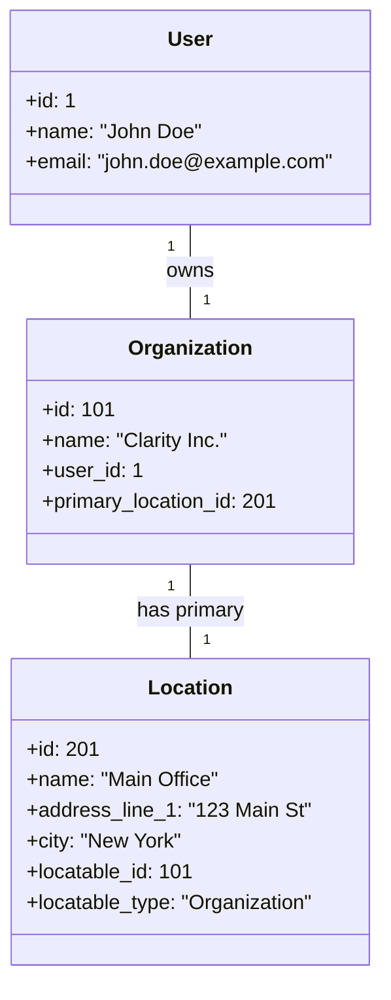
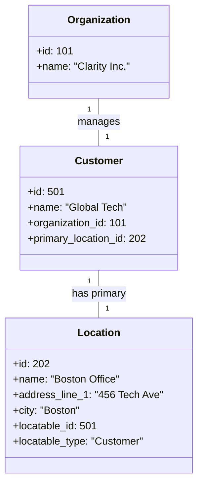
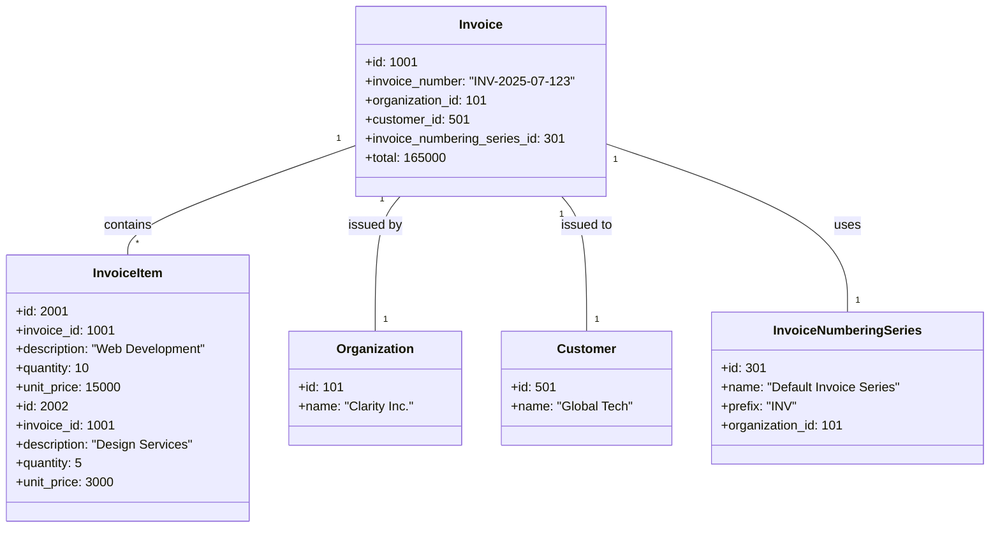
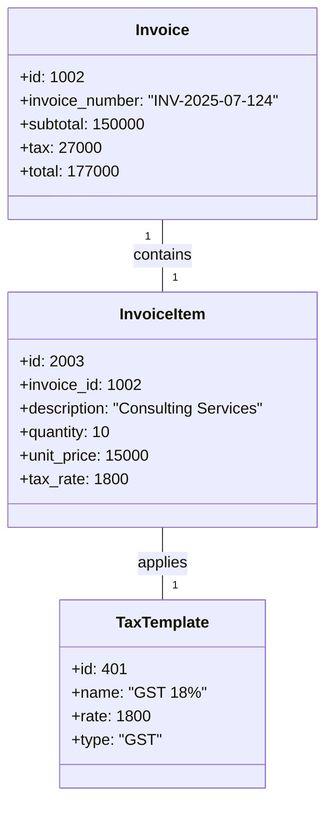

# Data Model Examples

This document provides several examples of how the application's data models relate to each other in common scenarios. These diagrams use Mermaid's class diagram syntax to represent instances of the models (objects) and their relationships.

## 1. Basic Organization Setup

This example shows a user named "John Doe" who owns an organization called "Clarity Inc.". The organization has a primary location in New York.

## 2. Organization with a Customer

Building on the previous example, "Clarity Inc." now has a customer, "Global Tech", which has its own location in Boston.

## 3. A Complete Invoice

This example shows a complete invoice created by "Clarity Inc." for "Global Tech". The invoice uses a specific numbering series and has two line items.

## 4. Invoice with Tax

This example shows a more realistic invoice that includes tax calculations. It features an invoice item with an 18% tax rate, and the main invoice reflects the calculated tax and total amounts.

