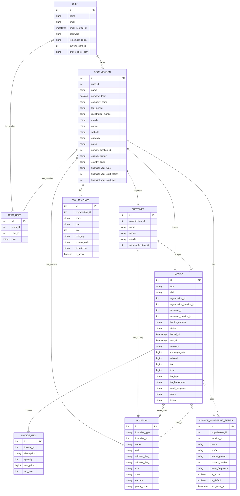

# Entity-Relationship Diagram

This document contains a text-based Entity-Relationship (ER) diagram for the application's database schema. You can render this into a visual diagram by pasting the code into a Mermaid.js-compatible viewer (e.g., GitHub's markdown renderer, [Mermaid Live Editor](https://mermaid.live)).

## Mermaid Diagram

