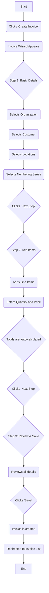
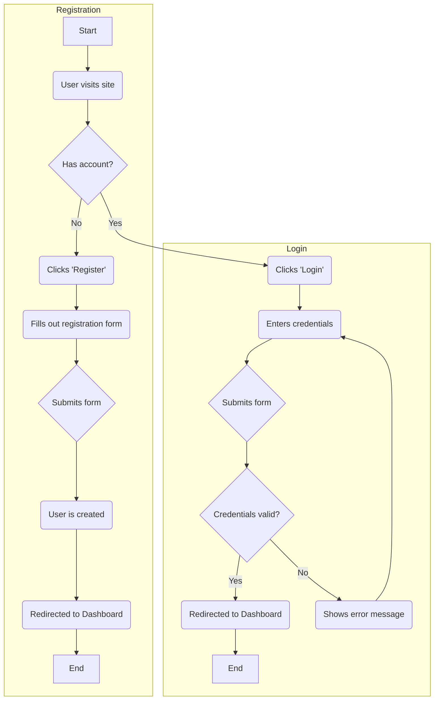
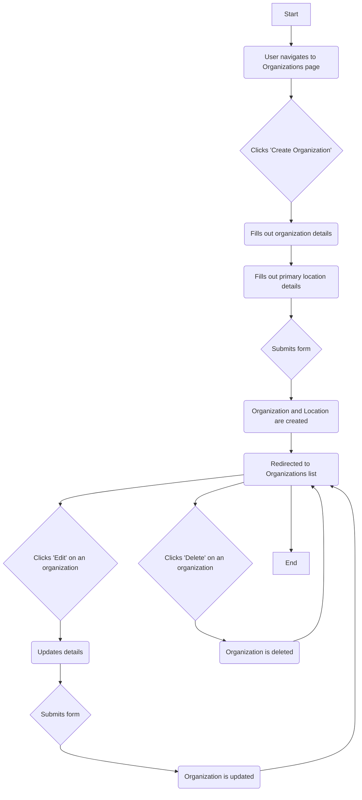
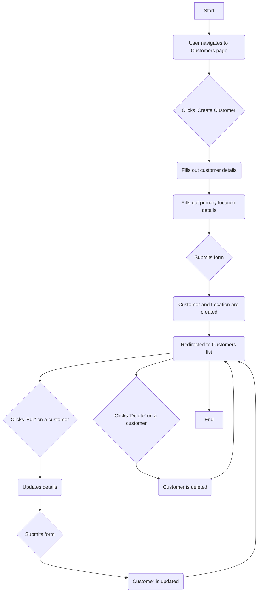
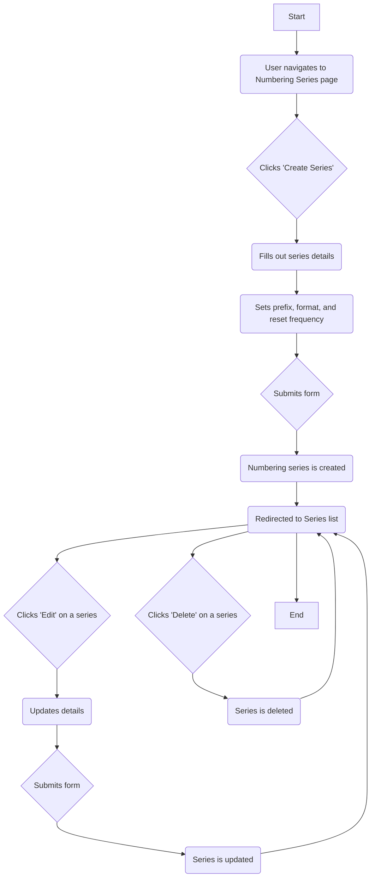
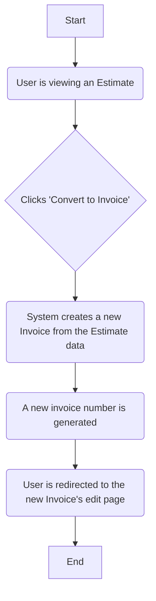

# Flow Diagrams

This document contains flow diagrams that illustrate the key user journeys in the application.

## 1. Invoice/Estimate Creation Flow

This diagram shows the steps a user takes to create a new invoice or estimate using the `InvoiceWizard` Livewire component.

## 2. User Authentication Flow

## 3. Organization Management Flow

## 4. Customer Management Flow

## 5. Numbering Series Management Flow

## 6. Estimate to Invoice Conversion Flow

