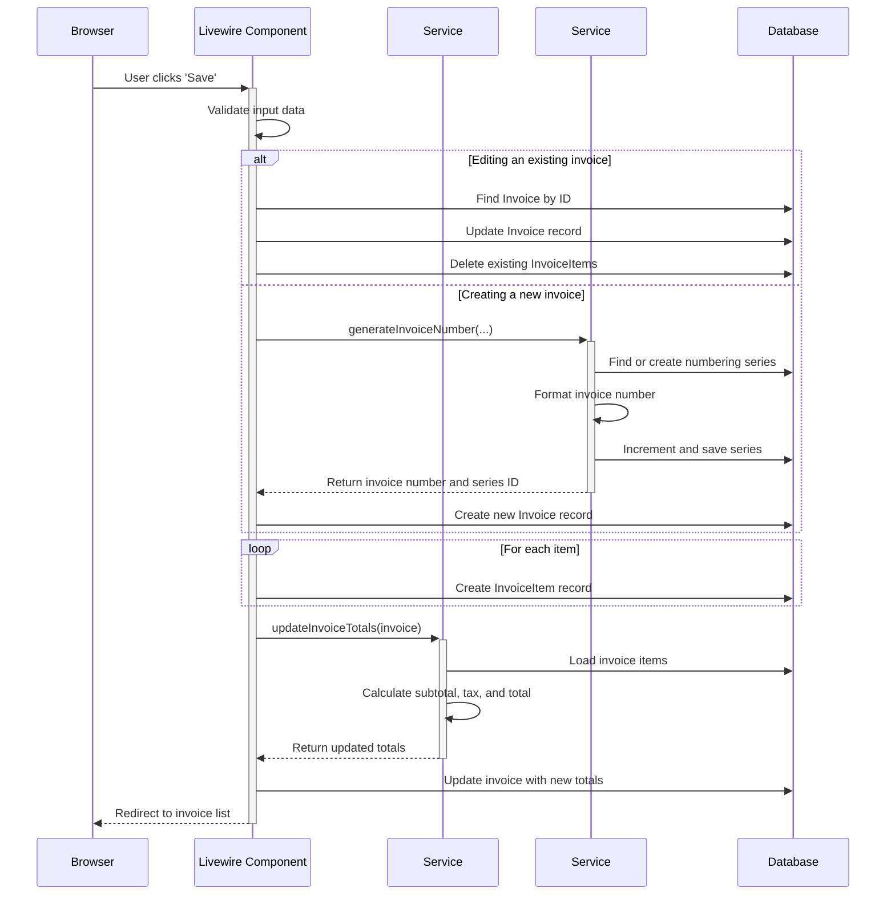
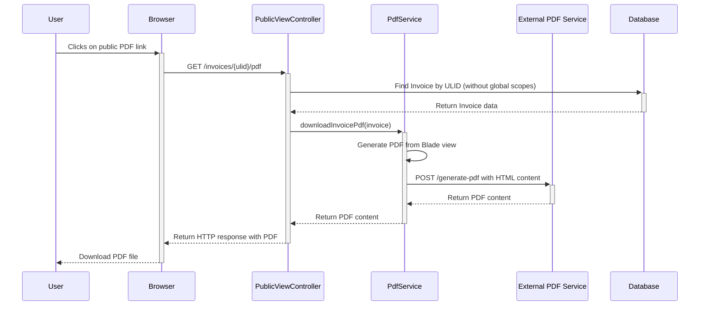

# Sequence Diagrams

This document contains sequence diagrams that illustrate the backend interactions for specific application flows.

## 1. Saving an Invoice

This diagram shows the sequence of events when a user saves an invoice using the `InvoiceWizard` Livewire component.

## 2. Public PDF Download

This diagram illustrates the process of a non-authenticated user downloading a PDF of an invoice.

